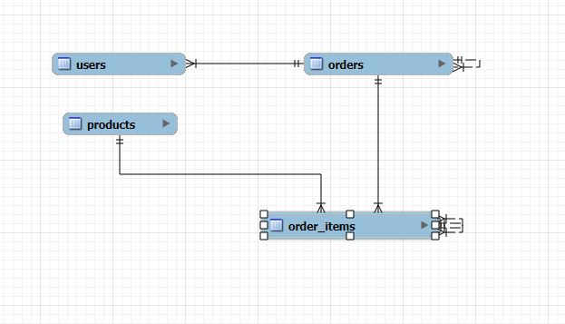

# 🛒 Boutique en ligne – Modélisation et gestion d'une base de données relationnelle avec MySQL

## 🎯 Introduction

Ce projet consiste à concevoir et implémenter une base de données relationnelle pour gérer les **utilisateurs**, **produits**, **commandes**, et **articles commandés** d'une boutique en ligne.

## 🎯 Objectifs du projet

- **Modéliser** une base de données avec des entités comme les utilisateurs, produits, commandes, et articles de commande.
- **Créer** les tables avec MySQL.
- **Peupler** les tables avec des données simulées pour démontrer un cas d’utilisation réaliste.
- **Gérer** les relations entre les entités via des clés étrangères (foreign keys) pour maintenir l'intégrité des données.

## 🗂️ Structure de la base de données

La base de données comporte **quatre principales tables** :

- `users` 🧑‍💼 : Stocke les informations des clients.
- `products` 🛍️ : Contient les détails des produits disponibles dans la boutique.
- `orders` 🧾 : Gère les commandes passées par les utilisateurs.
- `order_items` 📦 : Décompose chaque commande en éléments individuels.

### 📊 Schéma de la base de données

_Ajoute ici une capture d’écran du schéma de ta base de données._


## 🚀 Démarche étape par étape

1. **Modélisation des tables** avec des champs pour chaque entité.
2. **Création des tables** avec les scripts SQL fournis dans `online_shop.sql`.
3. **Insertion des données** pour peupler la base de données avec des utilisateurs, produits, commandes, et articles de commande.

## 📜 Requêtes SQL Avancées

### 🛒 Commandes avec détails des produits commandés

```sql
SELECT orders.id AS order_id, users.username, products.name AS product_name, order_items.quantity, order_items.price
FROM orders
JOIN users ON orders.user_id = users.id
JOIN order_items ON orders.id = order_items.order_id
JOIN products ON order_items.product_id = products.id;
```

### 💰 Montant total des ventes par produit

```sql
SELECT products.name, SUM(order_items.quantity) AS total_sold
FROM products
JOIN order_items ON products.id = order_items.product_id
GROUP BY products.name;
```

## 🏆 Résultats

La base de données est peuplée avec des données réalistes et peut être interrogée pour obtenir des informations sur les commandes, produits, et utilisateurs.


## 🔮 Évolutions possibles

- 💡 Ajout de requêtes SQL plus complexes (jointures, agrégations, etc.).
- 🛠️ Intégration de nouvelles fonctionnalités comme la gestion des paiements ou l'historique des commandes des utilisateurs.

## 🏁 Conclusion

Ce projet m'a permis de développer mes compétences en modélisation et gestion de bases de données avec MySQL. Il démontre ma capacité à concevoir des systèmes de gestion de données relationnelles, une compétence essentielle dans le développement web moderne. 🎉
